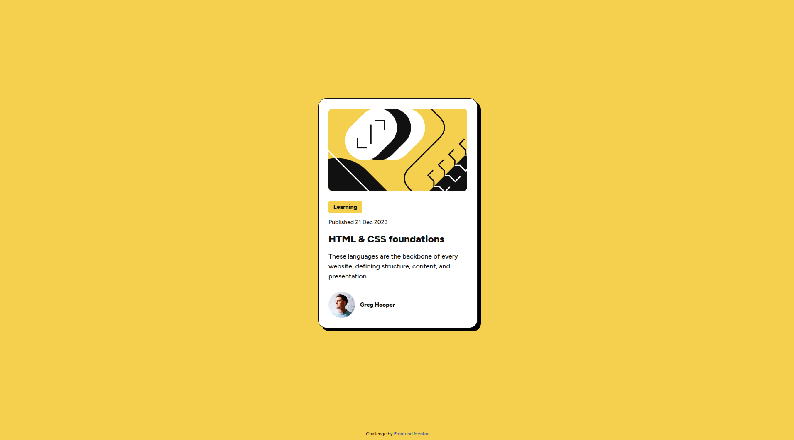

# Frontend Mentor - Blog preview card solution

This is a solution to the [Blog preview card challenge on Frontend Mentor](https://www.frontendmentor.io/challenges/blog-preview-card-ckPaj01IcS).

## Overview

A small, responsive card that displays blog preview information including image, title, description, author avatar and name. Built with semantic HTML and CSS (mobile-first).

### Screenshot

### Links

- Solution URL: https://github.com/Biruchenko/blog-preview-card
- Live Site URL: https://biruchenko.github.io/blog-preview-card/

### Built with

- Semantic HTML5
- CSS custom properties
- Flexbox
- CSS Grid
- Google Fonts - Figtree

### Useful resources

- [Frontend Mentor challenge](https://www.frontendmentor.io/challenges/blog-preview-card-ckPaj01IcS)
- MDN Web Docs — Flexbox: https://developer.mozilla.org/en-US/docs/Web/CSS/CSS_Flexible_Box_Layout
- MDN Web Docs — Grid: https://developer.mozilla.org/en-US/docs/Web/CSS/CSS_Grid_Layout
- CSS-Tricks: A Complete Guide to Flexbox (and Grid): https://css-tricks.com/snippets/css/a-guide-to-flexbox/
- CSS-Tricks: A Complete Guide to Grid: https://css-tricks.com/snippets/css/complete-guide-grid/
- clamp(): clamp():https://developer.mozilla.org/en-US/docs/Web/CSS/Reference/Values/clamp
- clamp generator: https://clamp.font-size.app/

## Acknowledgments

Thanks to the Frontend Mentor community for the challenge and styling inspiration.
